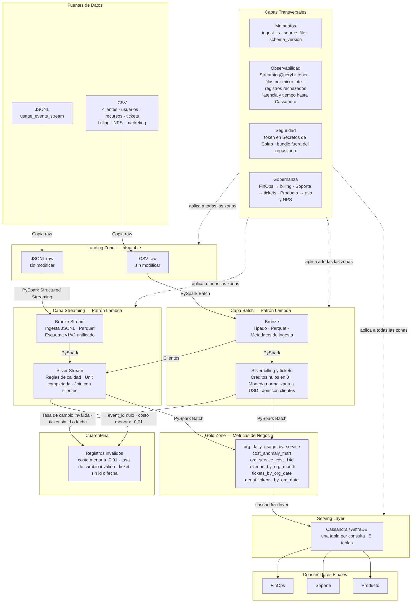

Versión 4 · 27/11/2026

```mermaid
flowchart TD
    subgraph SRC["Fuentes de Datos"]
        CSV["CSV\nclientes · usuarios · recursos · tickets\nbilling · NPS · marketing"]
        JSONL["JSONL\nusage_events_stream"]
    end

    subgraph LZ["Landing Zone — Inmutable"]
        RAW_B["CSV raw\nsin modificar"]
        RAW_S["JSONL raw\nsin modificar"]
    end

    subgraph BATCH["Capa Batch — Patrón Lambda"]
        BRZ_B["Bronze\nTipado · Parquet · Metadatos de ingesta"]
        SLV_B["Silver billing y tickets\nCréditos nulos en 0 · Moneda normalizada a USD · Join con clientes"]
    end

    subgraph STREAM["Capa Streaming — Patrón Lambda"]
        BRZ_S["Bronze Stream\nIngesta JSONL · Parquet\nEsquema v1/v2 unificado"]
        SLV_S["Silver Stream\nReglas de calidad · Unit completada · Join con clientes"]
    end

    subgraph GZ["Gold Zone — Métricas de Negocio"]
        GLD["org_daily_usage_by_service\ncost_anomaly_mart\norg_service_cost_14d\nrevenue_by_org_month\ntickets_by_org_date\ngenai_tokens_by_org_date"]
    end

    subgraph QUAR["Cuarentena"]
        Q["Registros inválidos\ncosto menor a -0,01 · tasa de cambio inválida · ticket sin id o fecha"]
    end

    subgraph SRV["Serving Layer"]
        CASS["Cassandra / AstraDB\nuna tabla por consulta · 5 tablas"]
    end

    subgraph GOV["Capas Transversales"]
        META["Metadatos\ningest_ts · source_file · schema_version"]
        OBS["Observabilidad\nStreamingQueryListener · filas por micro-lote · registros rechazados\nlatencia y tiempo hasta Cassandra"]
        SEC["Seguridad\ntoken en Secretos de Colab · bundle fuera del repositorio"]
        GVN["Gobernanza\nFinOps → billing · Soporte → tickets · Producto → uso y NPS"]
    end

    subgraph USR["Consumidores Finales"]
        FO["FinOps"]
        SP["Soporte"]
        PR["Producto"]
    end

    CSV -->|Copia raw| RAW_B
    JSONL -->|Copia raw| RAW_S
    RAW_B -->|PySpark Batch| BRZ_B
    RAW_S -->|PySpark Structured Streaming| BRZ_S
    BRZ_B -->|PySpark| SLV_B
    BRZ_S -->|PySpark| SLV_S
    BRZ_B -->|Clientes| SLV_S
    SLV_B -->|Tasa de cambio inválida · ticket sin id o fecha| Q
    SLV_S -->|event_id nulo · costo menor a -0,01| Q
    SLV_S -->|PySpark Batch| GLD
    SLV_B -->|PySpark Batch| GLD
    GLD -->|cassandra-driver| CASS
    CASS --> FO
    CASS --> PR
    CASS --> SP
    GOV -.->|aplica a todas las zonas| LZ
    GOV -.->|aplica a todas las zonas| BATCH
    GOV -.->|aplica a todas las zonas| STREAM
    GOV -.->|aplica a todas las zonas| SRV
```
